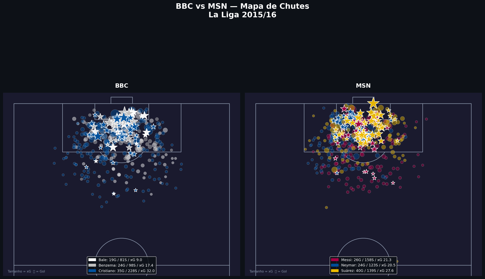
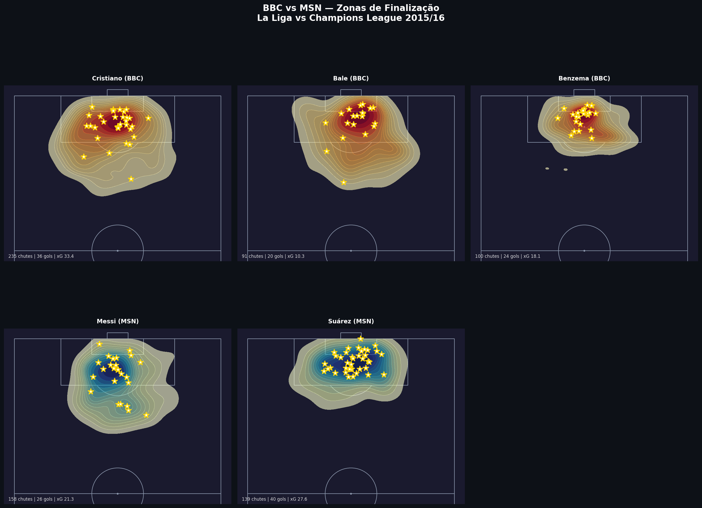

# BBC vs MSN - Tactical Action Classifier

[](https://colab.research.google.com/github/petersonantonio-science/bbc-vs-msn-classifier/blob/main/notebooks/BBC_vs_MSN_Setup.ipynb) [](https://github.com/statsbomb/open-data) [](https://www.soccer-net.org/) [](https://www.python.org/) [](LICENSE)

Comparative analysis of decision patterns and technical actions
between the two greatest attacking trios in recent football history,
using **Moondream 3** + **StatsBomb Open Data** + **SoccerNet**.

> Open source portfolio project — Peterson Antonio

---

## The Central Question

**Do the decision patterns of BBC and MSN change when
the context shifts from a league campaign (La Liga) to
a European knockout stage (Champions League)?**

Same players. Same season. Different pressure.

---

## The Players

| BBC - Real Madrid | MSN - Barcelona |
|---|---|
| Gareth Frank Bale | Lionel Andres Messi Cuccittini |
| Karim Benzema | Neymar da Silva Santos Junior |
| Cristiano Ronaldo dos Santos Aveiro | Luis Alberto Suarez Diaz |

> Player names follow StatsBomb API exact format.

---

## Historical Context

**La Liga 2015/16** - One of the most competitive seasons in history:
Barcelona (91 pts), Real Madrid (90) and Atletico (88)
separated by just 3 points.

**Champions League 2015/16** - Real Madrid eliminated
Manchester City in the quarterfinals and Atletico in the semis.
Barcelona fell to Atletico in the semifinals.
BBC and MSN never faced each other in the UCL that season,
making the comparison even more interesting.

---

## Data Sources

| Dataset | Usage | Access |
|---|---|---|
| StatsBomb Open Data | Events, coordinates, xG, pressure | Free |
| SoccerNet | Match videos (224p, NDA required) | Free |
| Moondream 3 | Technical action classification | Open Source |
| Real-ESRGAN | Frame upscaling 4x (~896p) | Open Source |

---

## Dataset

| Competition | BBC Matches | MSN Matches | Events |
|---|---|---|---|
| La Liga 2015/16 | 10 | 10 | 28,119 |
| UCL 2015/16 | 3 | 1* | 554 |

*Limited StatsBomb open data coverage for UCL 2015/16 - see Limitations.

**Match selection criteria:**
- Balanced contexts: wins + draws + losses for both teams
- El Clasico included (x2 — home and away)
- UCL matches for knockout stage context

---

## Architecture

```
StatsBomb Open Data (La Liga + UCL 2015/16)
        |
Filter events for all 6 players
(Shot, Dribble, Pass, Carry)
        |
For each event -> timestamp + x,y coordinates + xG + pressure
        |
Apply sync offset (-2.26s) validated against SoccerNet Labels
        |
SoccerNet -> extract 10s window at 4fps (~40 frames per event)
(4s before action + action + 6s after)
        |
Real-ESRGAN 4x upscale -> ~896p frames
        |
Moondream 3 -> classify technical action per frame
        |
Merge: tactical context (StatsBomb) + technical classification (Moondream)
        |
BBC vs MSN comparison by decision pattern
```

---

## Sync Validation

SoccerNet and StatsBomb timestamps were validated on El Clasico
(Real Madrid 0-4 Barcelona, La Liga 2015/16, 4 goals).

| Metric | Value |
|---|---|
| Goals compared | 4 |
| Mean offset | -2.26s |
| Stdev offset | 0.09s |
| Min / Max | -2.35s / -2.15s |
| Verdict | GOOD |

StatsBomb records events when the ball enters the net (~2.26s after
the shot moment annotated by SoccerNet). This consistent offset is
applied automatically in `extractor.py` via `SYNC_OFFSET_SECONDS = 2.26`.

Validation notebook: `notebooks/SoccerNet_StatsBomb_Sync_Validation.ipynb`

---

## Extraction Design Decisions

| Parameter | Value | Rationale |
|---|---|---|
| Video resolution | 224p | Already downloaded, sufficient for upscale |
| Upscale | Real-ESRGAN 4x | ~896p per frame, better for Moondream 3 |
| Window | 10s per event | Captures positioning -> action -> result |
| Window start | ts - 2.26s - 4s | Sync offset + pre-action context |
| FPS | 4 frames/s | ~40 frames per event, captures movement |
| Event types | Shot, Dribble, Pass, Carry | All ball-on-player actions |
| Est. frames | ~522,000 | La Liga + UCL all 6 players |
| Est. storage | ~26 GB | Google Drive 100GB plan |

---

## Quick Start

### Option 1 - Google Colab (recommended)
Click the badge at the top to open the setup notebook directly in Colab.
Run sections 1 to 6 in order.

### Option 2 - Local

**1. Request SoccerNet access**
Visit [soccer-net.org](https://www.soccer-net.org/),
fill out the form and wait for the email with your password.

**2. Set up your password**
Create `soccernet_key.txt` in the project root with only the password:

    your_password_here

**3. Install dependencies**

    pip install -r requirements.txt

**4. Run the setup notebook**
Open `notebooks/BBC_vs_MSN_Setup.ipynb` and run sections 1 to 6.

---

## Project Structure

```
bbc-vs-msn-classifier/
|- src/
|  |- config.py        # Player names, paths, constants, sync offset
|  |- loader.py        # Load and filter StatsBomb data
|  |- extractor.py     # Extract + upscale frames with FFmpeg + ESRGAN
|  |- classifier.py    # Classify actions with Moondream 3
|  |- merger.py        # Merge StatsBomb + Moondream
|  |- visualizer.py    # Pitch plots with mplsoccer
|- notebooks/
|  |- BBC_vs_MSN_Setup.ipynb                    # Full setup notebook
|  |- SoccerNet_StatsBomb_Sync_Validation.ipynb # Sync validation
|- data/
|  |- statsbomb/       # Event and match data (CSV)
|  |- frames/          # Extracted frames (not versioned)
|  |- annotations/     # JSON annotations
|  |- raw/             # SoccerNet videos (not versioned)
|- results/
|  |- pitch_plots/     # Shot maps and heatmaps
|  |- comparisons/     # BBC vs MSN comparisons
|- requirements.txt
|- .gitignore
|- CHANGELOG.md
|- README.md
```

---

## Sample Results

### Shot Map - La Liga 2015/16


### Finishing Zones - La Liga 2015/16


---

## Key Findings (Preliminary — La Liga 2015/16)

### Shot Statistics

| Player | Trio | Shots | Goals | Total xG | Avg xG | Conversion |
|---|---|---|---|---|---|---|
| Cristiano Ronaldo | BBC | 228 | 36 | 33.4 | 0.147 | 15.8% |
| Luis Suarez | MSN | 139 | 40 | 27.6 | 0.199 | 28.8% |
| Lionel Messi | MSN | 158 | 26 | 21.3 | 0.135 | 16.5% |
| Neymar Junior | MSN | 123 | - | - | - | - |
| Karim Benzema | BBC | 98 | 24 | 18.1 | 0.185 | 24.5% |
| Gareth Bale | BBC | 81 | 20 | 10.3 | 0.127 | 24.7% |

### Action Volume

| Player | Trio | Shots | Dribbles | Passes | Carries |
|---|---|---|---|---|---|
| Cristiano Ronaldo | BBC | 228 | 95 | 1,146 | 1,122 |
| Gareth Bale | BBC | 81 | 69 | 791 | 746 |
| Karim Benzema | BBC | 98 | 49 | 687 | 658 |
| Lionel Messi | MSN | 158 | 241 | 1,926 | 2,083 |
| Neymar Junior | MSN | 123 | 273 | 1,970 | 2,173 |
| Luis Suarez | MSN | 139 | 134 | 973 | 1,020 |

**Key insights:**
- Neymar leads all 6 players in dribbles (273) and carries (2,173)
- Suarez has the highest conversion rate (28.8%) despite fewer shots
- Cristiano leads in total shots (228) and total xG (33.4)
- MSN collectively generates more dribbles and carries than BBC
- BBC concentrates more in finishing (higher shots per player)

*UCL data available only for BBC players (3 matches).
*Neymar goals/xG to be confirmed after frame extraction phase.

---

## Honest Limitations

**1. No automatic player identification**
Moondream 3 classifies actions, not identities.
Clips are manually segmented by player.

**2. Neymar missing from UCL data**
StatsBomb open data does not include Barcelona UCL 2015/16
matches where Neymar appears in the available splits.
Note: Neymar API name is 'Neymar da Silva Santos Junior' (no accent).

**3. Limited UCL coverage**
Only 1 Barcelona match and 3 Real Madrid matches available
in StatsBomb open data for UCL 2015/16.

**4. No StatsBomb 360 for 2015/16**
Freeze frames with all player positions are not available
in the free tier for this season.

**5. Frame-by-frame processing**
Moondream 3 has no memory between frames.
Temporal context is assembled externally via 10s extraction window.

**6. 224p source resolution**
Source videos are 224p. Real-ESRGAN 4x upscale mitigates this
but introduces some reconstruction artifacts.

---

## Roadmap

- [x] StatsBomb Open Data pipeline (28,119 events, 6 players)
- [x] SoccerNet video download (20 matches, balanced BBC/MSN)
- [x] Sync validation (offset -2.26s, stdev 0.09s)
- [x] Extraction design decisions (4fps, 10s, ESRGAN 4x)
- [ ] Frame extraction from SoccerNet videos
- [ ] Real-ESRGAN upscale pipeline
- [ ] Action classification with Moondream 3
- [ ] Merge StatsBomb context + Moondream classifications
- [ ] BBC vs MSN comparative analysis
- [ ] Fine-tuning with annotated dataset
- [ ] Interactive web visualization
- [ ] Extension to 2022 FIFA World Cup (Messi, Cristiano, Modric)

---

## Stack

| Tool | Usage |
|---|---|
| Moondream 3 | Technical action classification |
| Real-ESRGAN | Frame upscaling 4x |
| statsbombpy | StatsBomb Open Data access |
| SoccerNet | Video download |
| FFmpeg | Frame extraction |
| OpenCV | Image preprocessing |
| mplsoccer | Pitch plots and visualizations |
| Pandas | Dataset structuring |

---

## References

- [StatsBomb Open Data](https://github.com/statsbomb/open-data)
- [SoccerNet](https://www.soccer-net.org)
- [Moondream 3](https://moondream.ai/blog/moondream-3-preview)
- [Real-ESRGAN](https://github.com/xinntao/Real-ESRGAN)
- [mplsoccer](https://mplsoccer.readthedocs.io)
- [statsbombpy](https://github.com/statsbomb/statsbombpy)

---

## License & Credits

- StatsBomb data: non-commercial use, attribution required
- SoccerNet videos: non-commercial use, NDA signed
- Original videos are NOT included in this repository
- Only annotation JSONs and code are versioned

*Data source: StatsBomb Open Data - statsbomb.com*

---

## Author

**Peterson Antonio**  
Sports Scientist & Developer  
Brazil  

[](https://github.com/petersonantonio-science)
[](https://www.linkedin.com/in/peterson-antonio-50776b246/)